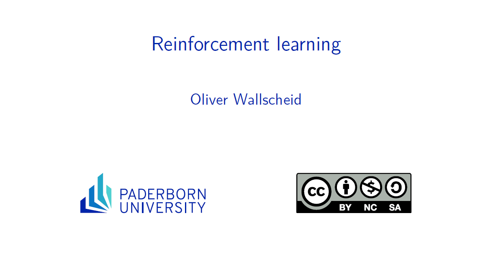

# Reinforcement learning course

[](https://github.com/IAS-Uni-Siegen/RL_course/actions/workflows/BuildPDFs.yml)
[![CC BY-NC-SA 4.0][cc-by-nc-sa-shield]][cc-by-nc-sa]
[](https://www.python.org/)
[](https://www.latex-project.org/)

This work is licensed under a
[Creative Commons Attribution-NonCommercial-ShareAlike 4.0 International License][cc-by-nc-sa].

[![CC BY-NC-SA 4.0][cc-by-nc-sa-image]][cc-by-nc-sa]

[cc-by-nc-sa]: http://creativecommons.org/licenses/by-nc-sa/4.0/
[cc-by-nc-sa-image]: https://licensebuttons.net/l/by-nc-sa/4.0/88x31.png
[cc-by-nc-sa-shield]: https://img.shields.io/badge/License-CC%20BY--NC--SA%204.0-lightgrey.svg

Lecture notes, tutorial tasks including solutions as well as online videos for a reinforcement learning course originally hosted at Paderborn University and transferred to University of Siegen. Source code for the entire course material is open and everyone is cordially invited to use it for self-learning (students) or to set up your own course (lecturers).


## Lecture slides (click on preview picture)
<a href="https://ias-uni-siegen.github.io/RL_course/lecture.pdf" target="_blank" class="image fit"></a>

01. Introduction to Reinforcement Learning
    * [Lecture video, part 1](https://www.youtube.com/watch?v=YqlNOCD0rfA)
    * [Lecture video, part 2](https://youtu.be/Yd99sn-64Z8)
    * [Lecture slides](https://groups.uni-paderborn.de/lea/share/lehre/reinforcementlearning/lecture_slides/built/Lecture01.pdf)   
02. Markov Decision Processes
    * [Lecture video](https://www.youtube.com/watch?v=ywn81iGQISE)
    * [Lecture slides](https://groups.uni-paderborn.de/lea/share/lehre/reinforcementlearning/lecture_slides/built/Lecture02.pdf) 
03. Dynamic Programming
    * [Lecture video](https://www.youtube.com/watch?v=vjIiYdidFPY)
    * [Lecture slides](https://groups.uni-paderborn.de/lea/share/lehre/reinforcementlearning/lecture_slides/built/Lecture03.pdf) 
04. Monte Carlo Methods
    * [Lecture video](https://www.youtube.com/watch?v=GBL0ArlONrM)
    * [Lecture slides](https://groups.uni-paderborn.de/lea/share/lehre/reinforcementlearning/lecture_slides/built/Lecture04.pdf) 
05. Temporal-Difference Learning
    * [Lecture video](https://www.youtube.com/watch?v=Rnf9Wanxnj8)
    * [Lecture slides](https://groups.uni-paderborn.de/lea/share/lehre/reinforcementlearning/lecture_slides/built/Lecture05.pdf) 
06. Multi-Step Bootstrapping
    * [Lecture video](https://www.youtube.com/watch?v=YYTSZTyjbQ4)
    * [Lecture slides](https://groups.uni-paderborn.de/lea/share/lehre/reinforcementlearning/lecture_slides/built/Lecture06.pdf) 
07. Planning and Learning with Tabular Methods
    * [Lecture video](https://www.youtube.com/watch?v=gvJ3__GmHqo)
    * [Lecture slides](https://groups.uni-paderborn.de/lea/share/lehre/reinforcementlearning/lecture_slides/built/Lecture07.pdf) 
08. Function Approximation with Supervised Learning
    * [Lecture video](https://www.youtube.com/watch?v=tXAxTiuvges)
    * [Lecture slides](https://groups.uni-paderborn.de/lea/share/lehre/reinforcementlearning/lecture_slides/built/Lecture08.pdf) 
09. On-Policy Prediction with Function Approximation
    * [Lecture video](https://www.youtube.com/watch?v=aA3MFRHrrtg)
    * [Lecture slides](https://groups.uni-paderborn.de/lea/share/lehre/reinforcementlearning/lecture_slides/built/Lecture09.pdf) 
10. Value-Based Control with Function Approximation
    * [Lecture video](https://www.youtube.com/watch?v=LE9dVVj5700)
    * [Lecture slides](https://groups.uni-paderborn.de/lea/share/lehre/reinforcementlearning/lecture_slides/built/Lecture10.pdf) 
11. Stochastic Policy Gradient Methods
    * [Lecture video](https://www.youtube.com/watch?v=LzuZUyVr2mY)
    * [Lecture slides](https://groups.uni-paderborn.de/lea/share/lehre/reinforcementlearning/lecture_slides/built/Lecture11.pdf) 
12. Deterministic Policy Gradient Methods
    * [Lecture video](https://www.youtube.com/watch?v=i6hOcGIgdoQ)
    * [Lecture slides](https://groups.uni-paderborn.de/lea/share/lehre/reinforcementlearning/lecture_slides/built/Lecture12.pdf) 
13. Further Contemporary RL Algorithms (TRPO, PPO)
    * [Lecture video](https://www.youtube.com/watch?v=H8rElrvs9Lo)
    * [Lecture slides](https://groups.uni-paderborn.de/lea/share/lehre/reinforcementlearning/lecture_slides/built/Lecture13.pdf)
14. Outlook and Research Insights
    * [Lecture video](https://www.youtube.com/watch?v=-TEzYSzXhW4)
    * [Lecture slides](https://groups.uni-paderborn.de/lea/share/lehre/reinforcementlearning/lecture_slides/built/Lecture14.pdf)
   

* Summary of Part One: Reinforcement Learning in Finite State and Action Spaces
    * [Lecture slides](https://groups.uni-paderborn.de/lea/share/lehre/reinforcementlearning/lecture_slides/built/Summary_Part_One.pdf) 
* Summary of Part Two: Reinforcement Learning Using Function Approximation
    * [Lecture slides](https://groups.uni-paderborn.de/lea/share/lehre/reinforcementlearning/lecture_slides/built/Summary_Part_Two.pdf) 
* Full course slides
    * [Lecture slides](https://groups.uni-paderborn.de/lea/share/lehre/reinforcementlearning/lecture_slides/built/main.pdf)


# Exercise Content
All exercises are based on Python 3.9 and site-packages according to the requirements.txt:
```
>>> pip install -r requirements.txt
```

01. Basics of Python for Scientific Computing 
    * [Tutorial video](https://www.youtube.com/watch?v=MJXVQXkOEAA&feature=youtu.be) (only 2022 edition available due to technical outage)
    * [Tutorial template](../master/exercises/templates/ex01)
    * [Tutorial solution](../master/exercises/solutions/ex01) 
02. Manually Solving Basic Markov Chain, Reward and Decision Problems
    * [Tutorial video](https://www.youtube.com/watch?v=JBliRPC_C5E&list=PL4GzQQuIDBGt82j99oDSWnjfrtwZ-79Yg&index=4)
    * [Tutorial template](../master/exercises/templates/ex02)
    * [Tutorial solution](../master/exercises/solutions/ex02) 
03. The Beer-Bachelor and Dynamic Programming (the Shortest Beer Problem)
    * [Tutorial video](https://www.youtube.com/watch?v=5ylYfeWnb_Y&list=PL4GzQQuIDBGt82j99oDSWnjfrtwZ-79Yg&index=3)
    * [Tutorial template](../master/exercises/templates/ex03)
    * [Tutorial solution](../master/exercises/solutions/ex03) 
04. Drive Through the Race Track with Monte Carlo Learning
    * [Tutorial video](https://www.youtube.com/watch?v=RNV7px4AS_E&list=PL4GzQQuIDBGt82j99oDSWnjfrtwZ-79Yg&index=4)
    * [Tutorial template](../master/exercises/templates/ex04)
    * [Tutorial solution](../master/exercises/solutions/ex04) 
05. Drive even Faster Using Temporal-Difference Learning
    * [Tutorial video](https://www.youtube.com/watch?v=5L3lhod1-CI&list=PL4GzQQuIDBGt82j99oDSWnjfrtwZ-79Yg&index=5)
    * [Tutorial template](../master/exercises/templates/ex05)
    * [Tutorial solution](../master/exercises/solutions/ex05) 
06. Stabilizing the Inverted Pendulum by Tabular Multi-Step Methods
    * [Tutorial video](https://www.youtube.com/watch?v=5k45M8ey_iw&list=PL4GzQQuIDBGt82j99oDSWnjfrtwZ-79Yg&index=6)
    * [Tutorial template](../master/exercises/templates/ex06)
    * [Tutorial solution](../master/exercises/solutions/ex06) 
07. Boosting the Inverted Pendulum by Integrating Learning & Planning (Dyna Framework)
    * [Tutorial video](https://www.youtube.com/watch?v=r9gLTDBzq5k&list=PL4GzQQuIDBGt82j99oDSWnjfrtwZ-79Yg&index=8)
    * [Tutorial template](../master/exercises/templates/ex07)
    * [Tutorial solution](../master/exercises/solutions/ex07) 
08. Predicting the Operating Behavior of a Real Electric Drive Systems with Supervised Learning
    * [Tutorial video](https://www.youtube.com/watch?v=Aivh5ykeJ2Q)
    * [Tutorial template](../master/exercises/templates/ex08)
    * [Tutorial solution](../master/exercises/solutions/ex08) 
09. Evaluate the Performance of Given Agents in the Mountain Car Problem Using Function Approximation 
    * [Tutorial video](https://www.youtube.com/watch?v=AY7fvqnjmGU)
    * [Tutorial template](../master/exercises/templates/ex09)
    * [Tutorial solution](../master/exercises/solutions/ex09) 
10. Escape from the Mountain Car Valley Using Semi-Gradient Sarsa & Least Square Policy Iteration
    * [Tutorial video](https://www.youtube.com/watch?v=IPxare_FmlE)
    * [Tutorial template](../master/exercises/templates/ex10)
    * [Tutorial solution](../master/exercises/solutions/ex10) 
11. Landing on the Moon with REINFORCE and Actor-Critic Methods
    * [Tutorial video](https://www.youtube.com/watch?v=dL6gK7ITVYU)
    * [Tutorial template](../master/exercises/templates/ex11)
    * [Tutorial solution](../master/exercises/solutions/ex11) 
12. Shoot for the moon with DDPG & PPO
    * [Tutorial video](https://www.youtube.com/watch?v=YpSC9lTQY4k)
    * [Tutorial template](../master/exercises/templates/ex12)
    * [Tutorial solution](../master/exercises/solutions/ex12) 

# Contributions
We highly appreciate any feedback and input to the course material e.g.
* typos or content-related discussions (please raise an issue)
* adding new contents (please provide a pull request)

If you like to contribute to the repo to a larger extent, please do not hesitate to contact us directly. 

# Credits
The lecture notes are inspired by
* [Richard S. Sutton, Andrew G. Barto, 'Reinforcement Learning: An Introduction' Second Edition MIT Press, Cambridge, MA, 2018](http://www.incompleteideas.net/book/the-book-2nd.html)
* [David Silver, UCL Course on Reinforcement Learning, 2015](https://www.davidsilver.uk/teaching/)

The tutorials are partly using pre-packed environments from
* [Gymnasium](https://gymnasium.farama.org/) (maintained branch of OpenAI's Gym)

# Citation
See "Cite this repository" on top

